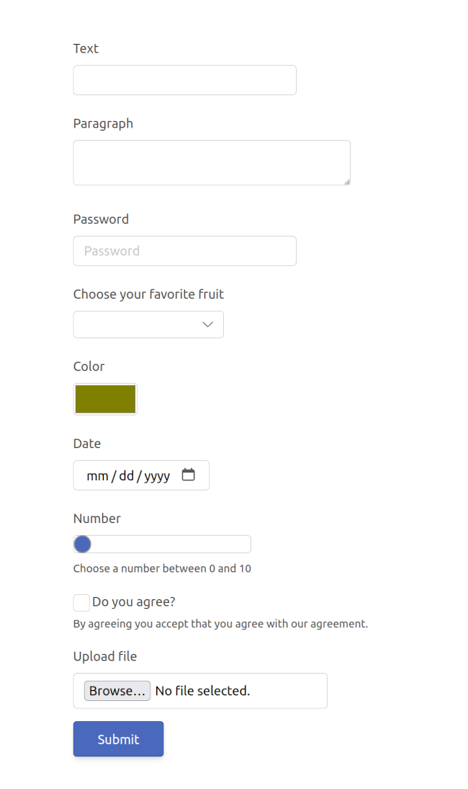

# Easy forms 

This package with help you build forms such as this:


With code that looks like:

```
Form.succeed Input Input
    |> Form.append text
    |> Form.append textArea
    |> Form.append password
    |> Form.append select
    |> Form.append color
    |> Form.append date
    |> Form.append number
    |> Form.append checkBox
    |> Form.append file
```

Take a look at the examples [here](https://github.com/yoghurt-x86/easy-forms/tree/master/examples)
